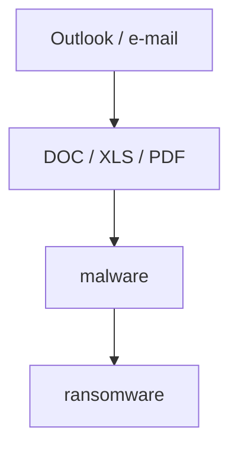

# Nejčastější útoky
---
layout: default
---
# Podvody (Scam)

**Jak to funguje?**

- Prodáváte na bazaru
- Kupující „zaplatí" přes Zásilkovnu / DPD
- „Zadejte číslo karty, …"

> **Prověřujte** — co vám kdo posílá a co po vás chce

  
  

---
layout: default
---
# Phishing · Smishing · Vishing

**Jak to funguje?**

- Nátlak / časová tíseň
- Propracovaný scénář
- Bankéř → Policie → GIBS

> **Nespěchejte, ověřte** pravost a druhou stranu

  

---
layout: default
---
# Nebezpečné reklamy (Malvertising)

**Jak to funguje?**

- Útočníci si platí reklamu, aby zacílili na oběti
- Vyhledávání (konkrétní klíčová slova)
- Sociální sítě, zpravodajské weby, bulvár

**Zvažte blokování reklam** — např. AdGuard

  

---
layout: default
---
# Info Stealer

**Jak to funguje?**

- Infikujete si počítač nebo prohlížeč
- Krádež veškerých užitečných dat (hesla, cookies, karty, …)

**Neukládejte si nic do prohlížeče!**

  

---
layout: default
---
# Škodlivá příloha

**Jak to funguje?**

**Zakažte makra** v Office aplikacích!

  

---
layout: default
---
# AI a nová rizika

- Prohlížeče **Perplexity Comet** / **OpenAI Atlas** mají potvrzenou **Prompt Injection**
- Vkládání kódu, API klíčů nebo testovacích dat do AI nástrojů → **únik dat**
- AI-generované testy mohou dávat **falešný pocit pokrytí**
- AI halucinuje — slepá důvěra bez vlastní verifikace je **bezpečnostní riziko**
- Produkční data v promptech = potenciální **porušení GDPR**

**Data mají cenu zlata!**

  

---
layout: image
image: /kahoot-threats.png
---
